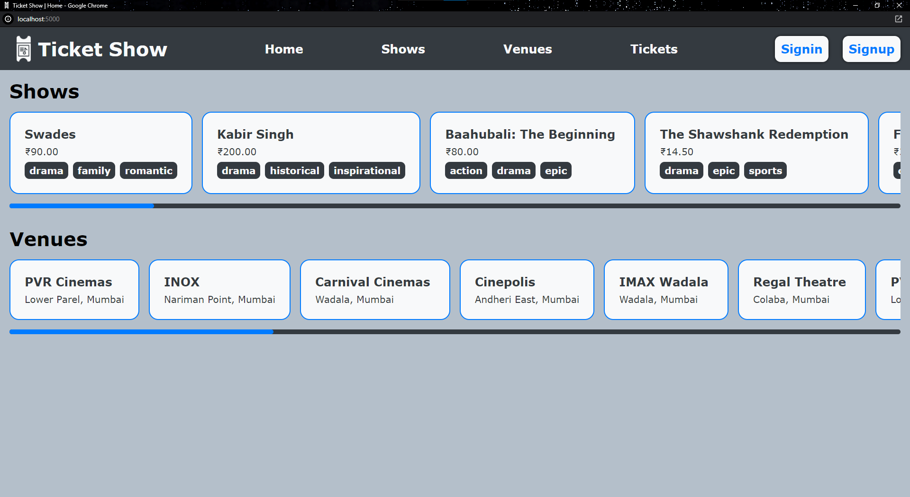
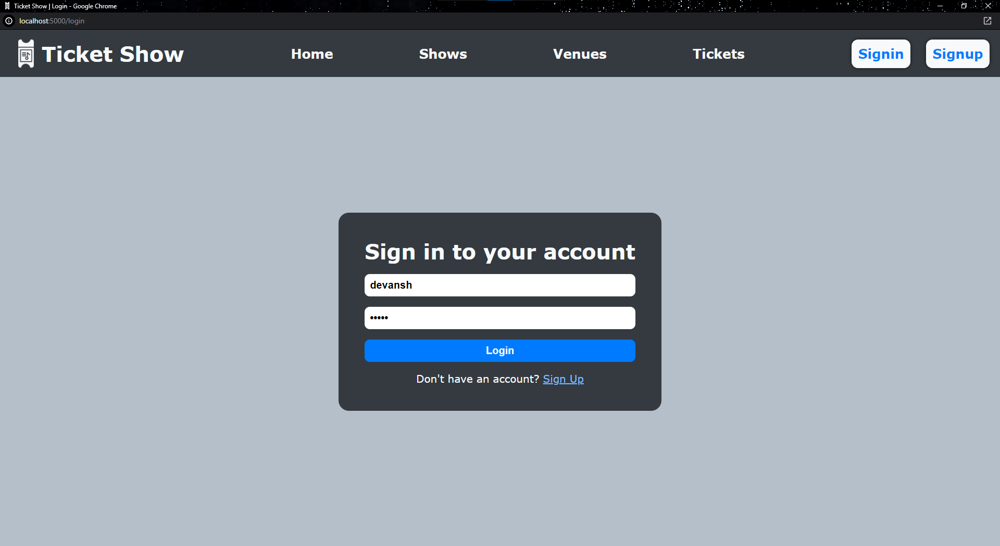
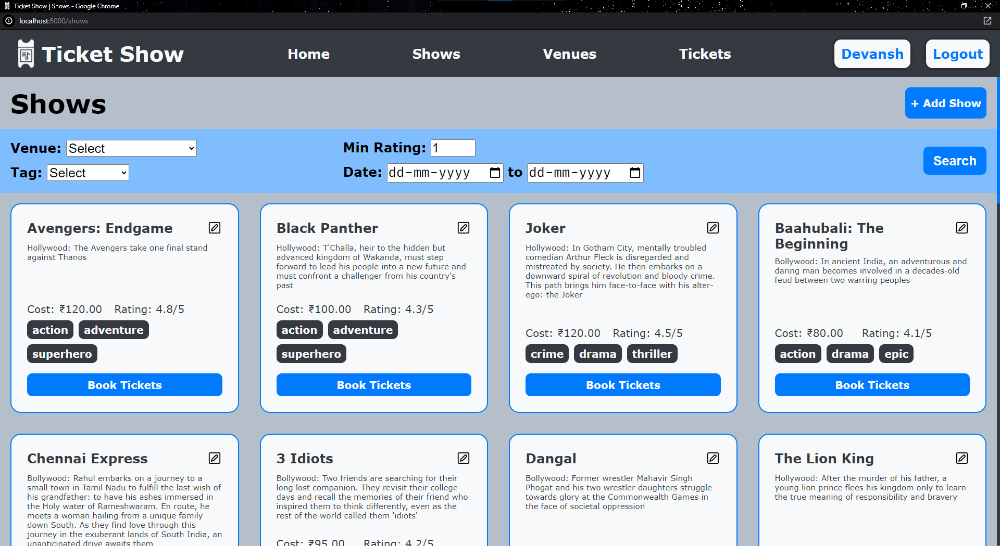
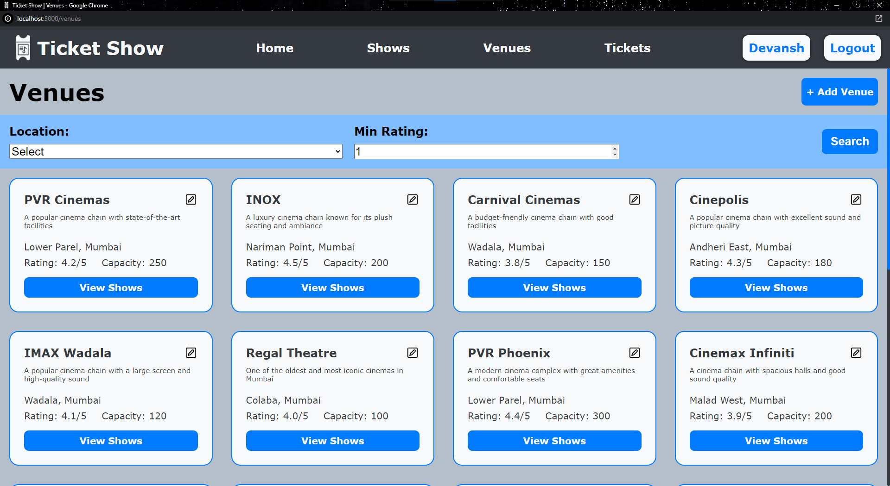

# Ticket Show

An app that allows user to browe shows and venues and book ticktes for the desired show.

Completed in fulfillment of the requirements of IITM BS in Data Science & Applications Degree Programme's [Modern Application Development (MAD-1) Project course (BSCS2003P)](https://study.iitm.ac.in/ds/course_pages/BSCS2003P.html).  









## Running the app

```bash
pip install -r requirements.txt
python app.py
```

the app should start at `http://127.0.0.1:5000`
